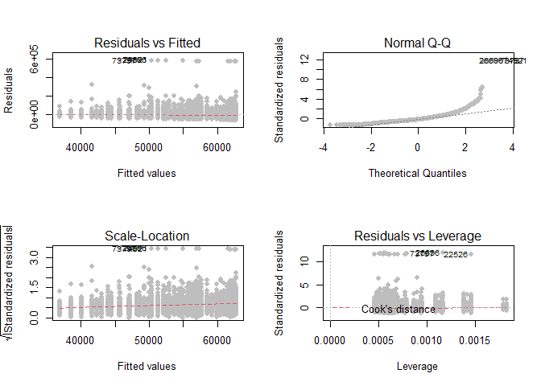
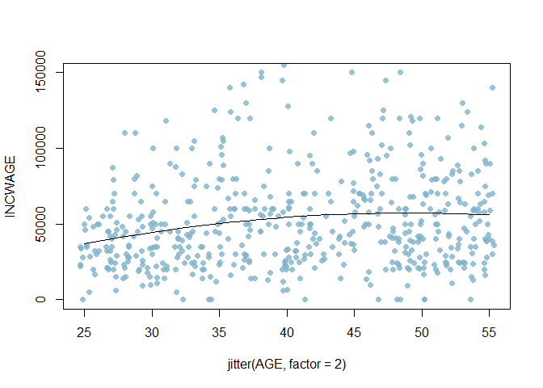
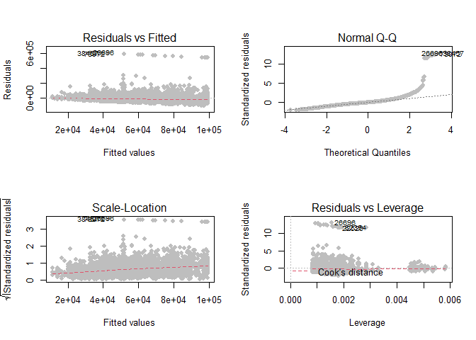
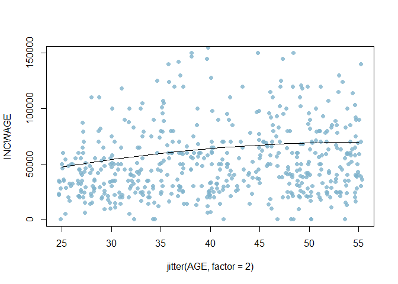
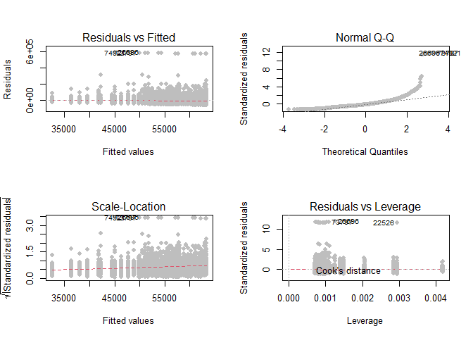

# Homework_5
hm\#5
================
Tamires Amorim, Yamei Li and Meirou Guan and Carol
11/2/2020

``` r
load("workspace.RData")
```

### Improving Regression Models to explain wages

The goal on this project is to understand the variables chosen and how
they affect the results. We will do that by experimenting regression
models with different inputs to see if our assumptions contain important
information for the explanation of wage.

First we loaded the data and subset it for the group chosen. The group
contain African Americans in the workforce, ages between 25 and 55,
working full time hours at least 48 weeks of the year. My interest in
this particular group comes from reading the analysis on the racial wage
gap in the New York times article “The Black-White Wage Gap Is as Big as
It Was in 1950” By David Leonhardt.

#### Model1. Non-linear regression with one dummy variable (female):

``` r
model1<-lm(INCWAGE~AGE+I(AGE^2)+female,data=dat_use)                                   
summary(model1)
```

    ## 
    ## Call:
    ## lm(formula = INCWAGE ~ AGE + I(AGE^2) + female, data = dat_use)
    ## 
    ## Residuals:
    ##    Min     1Q Median     3Q    Max 
    ## -62782 -25151  -9201  13285 592427 
    ## 
    ## Coefficients:
    ##               Estimate Std. Error t value Pr(>|t|)    
    ## (Intercept) -22306.324  14992.834  -1.488 0.136862    
    ## AGE           3468.278    767.458   4.519 6.34e-06 ***
    ## I(AGE^2)       -35.342      9.446  -3.742 0.000185 ***
    ## female       -5483.018   1349.316  -4.064 4.90e-05 ***
    ## ---
    ## Signif. codes:  0 '***' 0.001 '**' 0.01 '*' 0.05 '.' 0.1 ' ' 1
    ## 
    ## Residual standard error: 49510 on 5439 degrees of freedom
    ## Multiple R-squared:  0.01756,    Adjusted R-squared:  0.01701 
    ## F-statistic:  32.4 on 3 and 5439 DF,  p-value: < 2.2e-16

``` r
stargazer(model1, type = "text")
```

    ## 
    ## ===============================================
    ##                         Dependent variable:    
    ##                     ---------------------------
    ##                               INCWAGE          
    ## -----------------------------------------------
    ## AGE                        3,468.278***        
    ##                              (767.458)         
    ##                                                
    ## I(AGE2)                     -35.342***         
    ##                               (9.446)          
    ##                                                
    ## female                     -5,483.018***       
    ##                             (1,349.316)        
    ##                                                
    ## Constant                    -22,306.320        
    ##                            (14,992.830)        
    ##                                                
    ## -----------------------------------------------
    ## Observations                   5,443           
    ## R2                             0.018           
    ## Adjusted R2                    0.017           
    ## Residual Std. Error   49,511.160 (df = 5439)   
    ## F Statistic          32.399*** (df = 3; 5439)  
    ## ===============================================
    ## Note:               *p<0.1; **p<0.05; ***p<0.01

``` r
par(mfrow=c(2,2))
plot(model1,col="grey",pch=16,cex=1,lwd=1,lty=2)
```

<!-- -->

``` r
confint(model1, level=0.95)
```

    ##                    2.5 %      97.5 %
    ## (Intercept) -51698.27950  7085.63055
    ## AGE           1963.75274  4972.80371
    ## I(AGE^2)       -53.85927   -16.82533
    ## female       -8128.21729 -2837.81877

``` r
NNobs <- length(INCWAGE)
set.seed(12345) 
graph_obs <- (runif(NNobs) < 0.1) 
dat_graph <-subset(dat_use,graph_obs) 
a<-plot(INCWAGE ~ jitter(AGE, factor = 2), pch = 16, col = rgb(0.5, 0.7, 0.8, alpha = 0.8), ylim = c(0,150000), data = dat_graph)
to_be_predicted1 <- data.frame(AGE = 25:55, female = 1)
to_be_predicted1$yhat <- predict(model1, newdata = to_be_predicted1)
lines(yhat ~ AGE, data = to_be_predicted1)
```

<!-- -->

##### Observations from model1:

1.  The p-value of AGE and AGE^2 are both less than 0.01 at confidence
    level, which indicates that they are statistically significant.
2.  The regression function is INCWAGE = f(age) = -35.342age^2 +
    3468.278age - 5483.018 -22306.324, after doing the first derivative
    and set it equals to zero, we get -70.684 age + 3468.27 = 0 and
    (AGE=49).Which means that an 49-years-old African American female
    will reach the peak of the predicted wage of $116,365.61.
3.  We can be 95% confident that if there is in fact a relationship
    between income, age and gender, because they all fall between our
    confidence interval, indicating a relationship that works in this
    model, although, when we take the small multiple R2 into
    consideration, we see the model does not do very well at predicting
    income based on the variables of age and gender, as cited in class
    “R is doing something, but not doing much”.
4.  The residuals shows the unexplained variance across the range of the
    model, each plot gave us the information about the model fit or (the
    red line representing the mean of the residuals that should be
    horizontal and centered on zero, as indicated below), this indicates
    that there is not a lot of outliers causing bias in the model.

<!-- end list -->

``` r
summary(residuals(model1))
```

    ##    Min. 1st Qu.  Median    Mean 3rd Qu.    Max. 
    ##  -62782  -25151   -9201       0   13285  592427

#### Model2. Non-linear regression with more dummies (female, African American, and education from high school to advanced degree):

``` r
## Estimating income With more dummies.
model2 <-lm(INCWAGE~AGE+I(AGE^2)+female+AfAm+educ_hs+educ_somecoll+educ_college+educ_advdeg,data=dat_use)  
summary(model2)
```

    ## 
    ## Call:
    ## lm(formula = INCWAGE ~ AGE + I(AGE^2) + female + AfAm + educ_hs + 
    ##     educ_somecoll + educ_college + educ_advdeg, data = dat_use)
    ## 
    ## Residuals:
    ##    Min     1Q Median     3Q    Max 
    ## -97261 -20745  -6571  11729 605465 
    ## 
    ## Coefficients: (1 not defined because of singularities)
    ##                 Estimate Std. Error t value Pr(>|t|)    
    ## (Intercept)   -31515.018  14442.627  -2.182 0.029146 *  
    ## AGE             2698.800    725.508   3.720 0.000201 ***
    ## I(AGE^2)         -24.294      8.925  -2.722 0.006510 ** 
    ## female         -9665.431   1283.572  -7.530 5.90e-14 ***
    ## AfAm                  NA         NA      NA       NA    
    ## educ_hs         8893.261   3210.276   2.770 0.005620 ** 
    ## educ_somecoll  18160.987   3268.254   5.557 2.88e-08 ***
    ## educ_college   36036.327   3298.286  10.926  < 2e-16 ***
    ## educ_advdeg    56037.569   3476.550  16.119  < 2e-16 ***
    ## ---
    ## Signif. codes:  0 '***' 0.001 '**' 0.01 '*' 0.05 '.' 0.1 ' ' 1
    ## 
    ## Residual standard error: 46640 on 5435 degrees of freedom
    ## Multiple R-squared:  0.129,  Adjusted R-squared:  0.1278 
    ## F-statistic:   115 on 7 and 5435 DF,  p-value: < 2.2e-16

``` r
stargazer(model2, type = "text")
```

    ## 
    ## ===============================================
    ##                         Dependent variable:    
    ##                     ---------------------------
    ##                               INCWAGE          
    ## -----------------------------------------------
    ## AGE                        2,698.800***        
    ##                              (725.508)         
    ##                                                
    ## I(AGE2)                     -24.294***         
    ##                               (8.925)          
    ##                                                
    ## female                     -9,665.431***       
    ##                             (1,283.572)        
    ##                                                
    ## AfAm                                           
    ##                                                
    ##                                                
    ## educ_hs                    8,893.261***        
    ##                             (3,210.276)        
    ##                                                
    ## educ_somecoll              18,160.990***       
    ##                             (3,268.254)        
    ##                                                
    ## educ_college               36,036.330***       
    ##                             (3,298.286)        
    ##                                                
    ## educ_advdeg                56,037.570***       
    ##                             (3,476.550)        
    ##                                                
    ## Constant                   -31,515.020**       
    ##                            (14,442.630)        
    ##                                                
    ## -----------------------------------------------
    ## Observations                   5,443           
    ## R2                             0.129           
    ## Adjusted R2                    0.128           
    ## Residual Std. Error   46,636.480 (df = 5435)   
    ## F Statistic          114.962*** (df = 7; 5435) 
    ## ===============================================
    ## Note:               *p<0.1; **p<0.05; ***p<0.01

``` r
par(mfrow=c(2,2))
plot(model2,col="grey",pch=16,cex=1,lwd=1,lty=2)
```

<!-- -->

``` r
confint(model2, level=0.95)
```

    ##                      2.5 %       97.5 %
    ## (Intercept)   -59828.35099 -3201.684021
    ## AGE             1276.51314  4121.086714
    ## I(AGE^2)         -41.79116    -6.797047
    ## female        -12181.74618 -7149.115257
    ## AfAm                    NA           NA
    ## educ_hs         2599.83476 15186.687311
    ## educ_somecoll  11753.90011 24568.073098
    ## educ_college   29570.36586 42502.287432
    ## educ_advdeg    49222.13891 62852.999626

``` r
NNobs <- length(INCWAGE)
set.seed(12345) 
graph_obs <- (runif(NNobs) < 0.1) 
dat_graph <-subset(dat_use,graph_obs) 
a<-plot(INCWAGE ~ jitter(AGE, factor = 2), pch = 16, col = rgb(0.5, 0.7, 0.8, alpha = 0.8), ylim = c(0,150000), data = dat_graph)
to_be_predicted1 <- data.frame(AGE = 25:55, female = 1, AfAm = 1, educ_hs = 0, educ_somecoll = 0, educ_college = 1, educ_advdeg = 0)
to_be_predicted1$yhat <- predict(model2, newdata = to_be_predicted1)
```

    ## Warning in predict.lm(model2, newdata = to_be_predicted1): prediction from a
    ## rank-deficient fit may be misleading

``` r
lines(yhat ~ AGE, data = to_be_predicted1)
```

<!-- -->

##### Observations from model2:

1.  The variable Afam was dropped by R, because it is already on the
    subset, my guess is that I cannot use African American to explain
    African American in a regression, it is very redundant.  
2.  The AGE^2 and education high school became less statistically
    significant when we added higher degrees of education, probably
    because the relation between higher education and better income is
    stronger than those indicators.  
3.  All the variables still fall between our confidence interval of 95%,
    indicating a relationship that works in this model, although, for
    age, age^2 and gender its boundaries got bigger than the first
    model, possibly due to the increase in the variables taken into
    account, the multiple R^2 had a slightly increase as well.
4.  Differently from the first model, when we look at the residuals now,
    it seems that with the increase in the dummy variables we have more
    outliers, since the mean is not a very nice horizontal line close to
    zero in each plot.

#### Model3. Adding higher order polynomial terms of age with one dummy variable (female):

``` r
## Adding higher polynomial terms of age
model3<-lm(INCWAGE~AGE+I(AGE^2)+I(AGE^3)+I(AGE^4)+female,data=dat_use)
summary(model3)
```

    ## 
    ## Call:
    ## lm(formula = INCWAGE ~ AGE + I(AGE^2) + I(AGE^3) + I(AGE^4) + 
    ##     female, data = dat_use)
    ## 
    ## Residuals:
    ##    Min     1Q Median     3Q    Max 
    ## -63355 -25307  -9171  13340 592884 
    ## 
    ## Coefficients:
    ##               Estimate Std. Error t value Pr(>|t|)    
    ## (Intercept) -6.193e+05  3.682e+05  -1.682   0.0926 .  
    ## AGE          6.480e+04  3.878e+04   1.671   0.0948 .  
    ## I(AGE^2)    -2.339e+03  1.500e+03  -1.559   0.1190    
    ## I(AGE^3)     3.758e+01  2.529e+01   1.486   0.1374    
    ## I(AGE^4)    -2.251e-01  1.569e-01  -1.434   0.1515    
    ## female      -5.484e+03  1.349e+03  -4.064 4.89e-05 ***
    ## ---
    ## Signif. codes:  0 '***' 0.001 '**' 0.01 '*' 0.05 '.' 0.1 ' ' 1
    ## 
    ## Residual standard error: 49510 on 5437 degrees of freedom
    ## Multiple R-squared:  0.01814,    Adjusted R-squared:  0.01724 
    ## F-statistic:  20.1 on 5 and 5437 DF,  p-value: < 2.2e-16

``` r
stargazer(model3, type = "text")
```

    ## 
    ## ===============================================
    ##                         Dependent variable:    
    ##                     ---------------------------
    ##                               INCWAGE          
    ## -----------------------------------------------
    ## AGE                         64,800.730*        
    ##                            (38,783.120)        
    ##                                                
    ## I(AGE2)                     -2,339.128         
    ##                             (1,500.350)        
    ##                                                
    ## I(AGE3)                       37.576           
    ##                              (25.289)          
    ##                                                
    ## I(AGE4)                       -0.225           
    ##                               (0.157)          
    ##                                                
    ## female                     -5,483.500***       
    ##                             (1,349.226)        
    ##                                                
    ## Constant                   -619,277.500*       
    ##                            (368,158.500)       
    ##                                                
    ## -----------------------------------------------
    ## Observations                   5,443           
    ## R2                             0.018           
    ## Adjusted R2                    0.017           
    ## Residual Std. Error   49,505.440 (df = 5437)   
    ## F Statistic          20.095*** (df = 5; 5437)  
    ## ===============================================
    ## Note:               *p<0.1; **p<0.05; ***p<0.01

``` r
par(mfrow=c(2,2))
plot(model3,col="grey",pch=16,cex=1,lwd=1,lty=2)
```

<!-- -->

``` r
NNobs <- length(INCWAGE)
set.seed(12345) 
graph_obs <- (runif(NNobs) < 0.1) 
dat_graph <-subset(dat_use,graph_obs) 
a<-plot(INCWAGE ~ jitter(AGE, factor = 2), pch = 16, col = rgb(0.5, 0.7, 0.8, alpha = 0.8), ylim = c(0,150000), data = dat_graph)
to_be_predicted1 <- data.frame(AGE = 25:55, female = 1)
to_be_predicted1$yhat <- predict(model3, newdata = to_be_predicted1)
lines(yhat ~ AGE, data = to_be_predicted1)
```

<!-- -->

``` r
confint(model3, level=0.95)
```

    ##                     2.5 %        97.5 %
    ## (Intercept) -1.341015e+06  1.024605e+05
    ## AGE         -1.122973e+04  1.408312e+05
    ## I(AGE^2)    -5.280415e+03  6.021585e+02
    ## I(AGE^3)    -1.200088e+01  8.715290e+01
    ## I(AGE^4)    -5.326678e-01  8.253270e-02
    ## female      -8.128524e+03 -2.838476e+03

##### Observations from model3:

1.  The polynomials now account for the outliers we saw on model2,
    although they are not statistically significant when we look into
    the stargaze summary, the only variable that explains wage is
    gender.
2.  For the confidence interval all the variables went into smaller
    numbers in the boundaries which raised questions I still do not
    fully understand.  
3.  when we look into the R^2, it contains the same information in
    model1, which implies that model3 has the same evaluation capacity
    as model1.

#### Model4. Adding log to age with one dummy variable (female):

``` r
## experiment of colinearity
model4<-lm(INCWAGE~log(AGE)+I(log(AGE^2))+I(log(AGE^3))+I(log(AGE^4))+female,data=dat_use)
summary(model4)
```

    ## 
    ## Call:
    ## lm(formula = INCWAGE ~ log(AGE) + I(log(AGE^2)) + I(log(AGE^3)) + 
    ##     I(log(AGE^4)) + female, data = dat_use)
    ## 
    ## Residuals:
    ##    Min     1Q Median     3Q    Max 
    ## -65481 -25021  -9380  13438 592170 
    ## 
    ## Coefficients: (3 not defined because of singularities)
    ##               Estimate Std. Error t value Pr(>|t|)    
    ## (Intercept)     -33905      10665  -3.179  0.00149 ** 
    ## log(AGE)         24801       2885   8.597  < 2e-16 ***
    ## I(log(AGE^2))       NA         NA      NA       NA    
    ## I(log(AGE^3))       NA         NA      NA       NA    
    ## I(log(AGE^4))       NA         NA      NA       NA    
    ## female           -5432       1350  -4.023 5.82e-05 ***
    ## ---
    ## Signif. codes:  0 '***' 0.001 '**' 0.01 '*' 0.05 '.' 0.1 ' ' 1
    ## 
    ## Residual standard error: 49540 on 5440 degrees of freedom
    ## Multiple R-squared:  0.0161, Adjusted R-squared:  0.01574 
    ## F-statistic:  44.5 on 2 and 5440 DF,  p-value: < 2.2e-16

``` r
stargazer(model3, type = "text")
```

    ## 
    ## ===============================================
    ##                         Dependent variable:    
    ##                     ---------------------------
    ##                               INCWAGE          
    ## -----------------------------------------------
    ## AGE                         64,800.730*        
    ##                            (38,783.120)        
    ##                                                
    ## I(AGE2)                     -2,339.128         
    ##                             (1,500.350)        
    ##                                                
    ## I(AGE3)                       37.576           
    ##                              (25.289)          
    ##                                                
    ## I(AGE4)                       -0.225           
    ##                               (0.157)          
    ##                                                
    ## female                     -5,483.500***       
    ##                             (1,349.226)        
    ##                                                
    ## Constant                   -619,277.500*       
    ##                            (368,158.500)       
    ##                                                
    ## -----------------------------------------------
    ## Observations                   5,443           
    ## R2                             0.018           
    ## Adjusted R2                    0.017           
    ## Residual Std. Error   49,505.440 (df = 5437)   
    ## F Statistic          20.095*** (df = 5; 5437)  
    ## ===============================================
    ## Note:               *p<0.1; **p<0.05; ***p<0.01

``` r
par(mfrow=c(2,2))
plot(model3,col="grey",pch=16,cex=1,lwd=1,lty=2)
```

<!-- -->

##### Observations from model4:

1.  When we insert the log in age it is possible to observe the
    percentage change we did not observe on model 1, in age predicting
    the income. However, adding log to polynomials was useless.
    Confirmed by the same R^2 as model 1. My guess is that explaining
    wage by the percentage change increase in age is not useful for the
    model, since people do not get higher income just because they got
    older, there are more variables that should be taken into
    consideration, for instance, if a younger person receives a raise in
    their job because of productivity not because of aging.

<!-- end list -->

``` r
detach()
```

``` r
save.image("workspace.RData")
```
